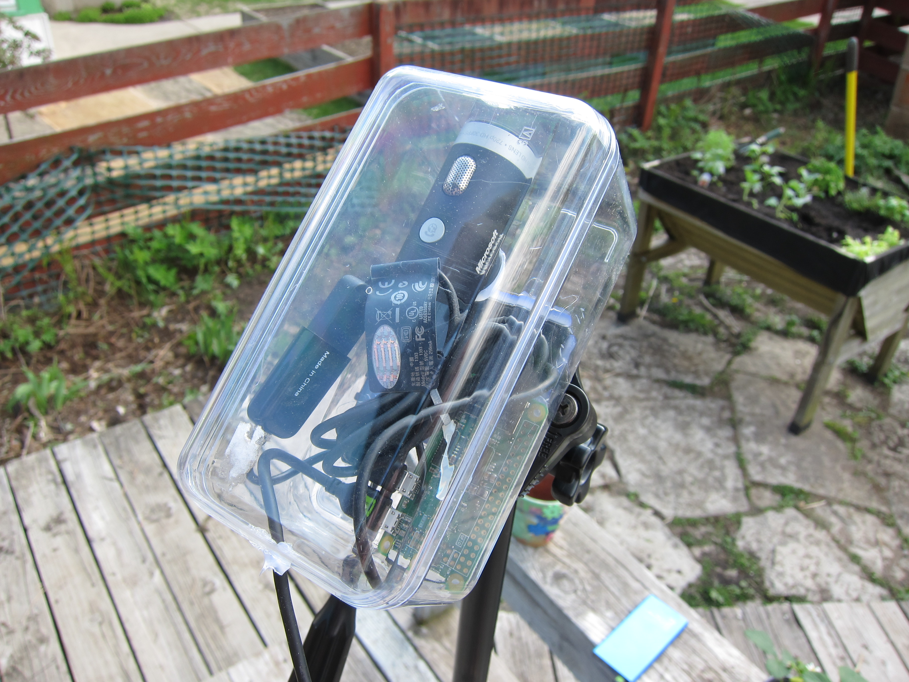

# SkyWatcher
**An automated aircraft annotation system for my backyard.. or anywhere really**

## Description
SkyWatcher is designed to do one thing: Automate the task of capturing aircraft images along with annotations. Why? Firstly, I live in the approach path to MSP. Secondly, I love airplanes, and lastly I really like exploring robotics, machine learning and computer vision topics. The end goal is to be able to build a detector/classifier someday that can reliably determine what type of aircraft is being observed through visual recognition alone. To do that I need a lot of training samples and although I'm no stranger to hand annotation (https://github.com/froohoo/Inference) I didn't really want to do that again. Plus I have always been intrigued by opportunites to automate the generation of high quality training annotated data.

## Operation

### Capture Video (Step 1)
SkyWatcher's video capture setup is based in large part on the excellent tutorial provided by Adrian Rosebrock [located here](https://www.pyimagesearch.com/2019/04/15/live-video-streaming-over-network-with-opencv-and-imagezmq/). It uses ØMQ to transoport images captured by a raspberry pi zero W. I liked this idea because the zero W is cheap ($5 at Micro Center) and I already had a webcam to use with it. For my setup, I assembled everything into a used Ferro Rocher chocolate box ($7.39 at Target). Bonus: You get to eat the chocoloates inside. Everything is precision attached with hot glue.

### Motion Detection & Cropping (Step 2)
Even though I live in the approach path, and the aircraft on approach appear huge, they only occupy a small portion of the image frame. 

The mobile net detector I was using takes 300x300 images, so a couple options were available. I could modify the input layer to accept a larger image but it didn't seem to make sense to add all those extra parameters when most of the images were just empty sky. I could have resized the images, either ahead of time or as part of the data augmentation layers of the network, but that would lose much of the detail within the region of interest. So instead, I settled on background segmentation and implemented a simple, but adequate motion tracker to identify the ROI, and then extract it as a 300x300 crop of the original image. Cropping is done by finding the center of a bounding box encompassing all the pixels with detected motion,and then cropping a 300x300 image from it's center. As a result, a crop from the above image that would be fed into the MobileNet-SSD is shown below. Note that the moving plane is off center because it is near the edge and while I could have implemented a 'same-padding' approach to the cropping, I instead chose to shift the crop center for motion at edges.

### Forward Pass through MobileNet-SSD for detection of Aircraft
The crop is fed through the pretrained MobileNet-SSD to find any aircraft in the cropped image. If a aircraft is found, the bounding box, along with the cropped image is placed on the queue of the annotation process so that the main routine can continue extracting crops and aircraft. A visual overview of everything working together (again, modified and repurposed from Adrian's tutorial) can be seen in the gif below for this fine example of an Minnesota Air National Guard C130 on approach. The black frame on the right displays the motion detection mask, overlayed on the frame. The mask is convlovled with a small errosion kernel to remove any point noise from the webcam sensor. This is a little heavy handed and delays the initial detection of the motion, but the current Network can not successfully detect planes at that point anyway, so it would not have an overall value to make it more sensitive at this time. 

